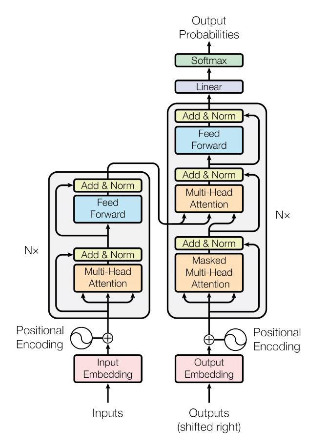

# Transformer
This is PyTorch implementation of [Attention is All You Need](https://arxiv.org/abs/1706.03762) (NeurIPS 2017). 

## Overview


## Environment
All dependencies are written in [requirements.txt](https://github.com/youngerous/transformer/blob/main/requirements.txt), and you can also access through [Dockerfile](https://github.com/youngerous/transformer/blob/main/Dockerfile).

## How to Run
```sh
sh run.sh
```

## Reference
- [[Tutorial] The Annotated Transformer :: Harvard NLP](https://nlp.seas.harvard.edu/2018/04/03/attention.html)
- [[Tutorial] nlp-tutorial :: graykode](https://github.com/graykode/nlp-tutorial)
- [[Dataset] 한국어-영어 번역(병렬) 말뭉치 AI 데이터 :: AiHub](https://aihub.or.kr/aidata/87)