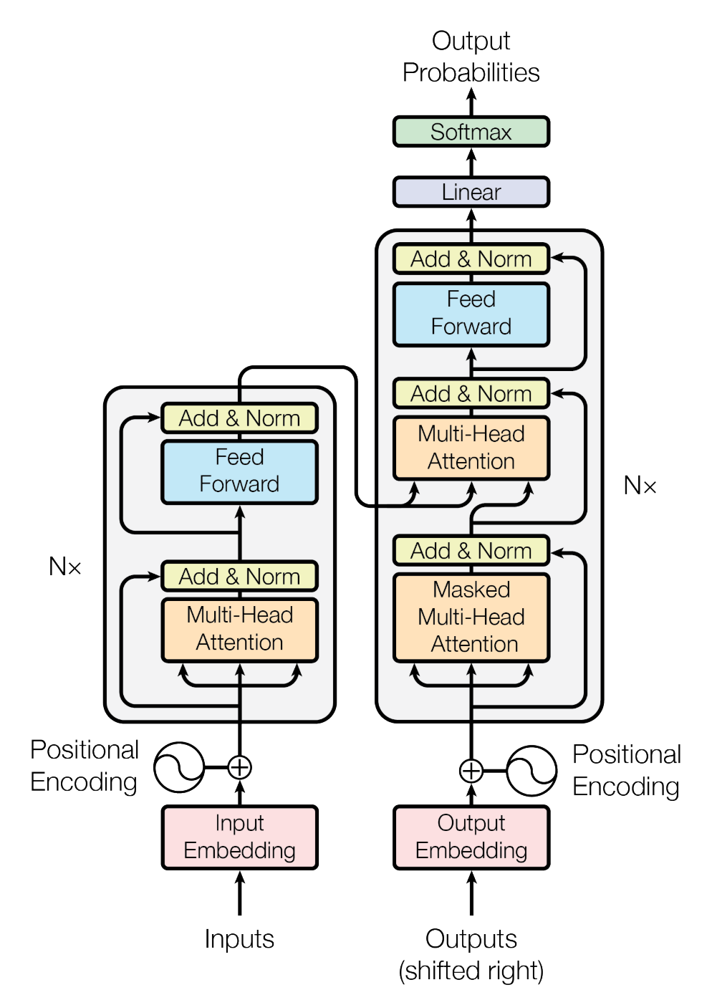

# Transformer
This is PyTorch implementation of [Attention is All You Need](https://arxiv.org/abs/1706.03762) (NeurIPS 2017). 

## 0. Overview


- Task: Neural Machine Translation (Korean → English)
- Dataset: 한국어-영어 번역(병렬) 말뭉치 AI 데이터 중 구어체 데이터 40만 개

    |  Train  | Valid  |  Test  |
    | :-----: | :----: | :----: |
    | 289,000 | 51,000 | 60,000 |

    > You should request dataset to [AIHub](https://aihub.or.kr/aidata/87), then you can preprocess dataset following [this file](https://github.com/youngerous/transformer/blob/main/src/trn_val_tst_split.ipynb).

- For tokenizing, I used [huggingface's multilingual BERT tokenizer](https://huggingface.co/transformers/multilingual.html).

## 1. Data Structure
```sh
src/
  └─ data/
    └─ cached/ # tokenized indice with special tokens
        ├─ cached_train.jsonl
        ├─ cached_valid.jsonl
        └─ cached_test.jsonl
    ├─ 1_구어체(1)_200226.xlsx # raw data
    ├─ 1_구어체(2)_200226.xlsx
    ├─ train_289000.csv # follow trn_val_tst_split.ipynb
    ├─ valid_51000.csv
    └─ test_60000.csv
```

## 2. Environment

- torch==1.7.1
- transformers=4.5.1

All dependencies are written in [requirements.txt](https://github.com/youngerous/transformer/blob/main/requirements.txt), and you can also access through [Dockerfile](https://github.com/youngerous/transformer/blob/main/Dockerfile).

## 3. How to Run

**Note**: In this implementation, ```[CLS]``` and ```[SEP]``` tokens mean ```<s>``` and ```</s>``` respectively.

### Train
```sh
sh run.sh
```

### Inference
```sh
python src/translate.py --source "KOREAN_TEXT_TO_TRANSLATE" --ckpt-path "CHECKPOINT_TO_LOAD"
```

## 4. Translation Results
These samples are from checkpoint with hyperparameters in ```run.sh``` file(trained about 360k steps).

```markdown
- Source: 오늘 커피 한 잔 할래요?
- Translated: Would you like to have a cup of coffee today?
```
```markdown
- Source: 나 오늘 늦게 퇴근해
- Translated: I'm going to work late today.
```
```markdown
- Source: 번역이 정말 잘 되네요!
- Translated: It's a great translation.
```

## 5. Reference
- [[Tutorial] The Annotated Transformer :: Harvard NLP](https://nlp.seas.harvard.edu/2018/04/03/attention.html)
- [[Tutorial] nlp-tutorial :: graykode](https://github.com/graykode/nlp-tutorial)
- [[Dataset] 한국어-영어 번역(병렬) 말뭉치 AI 데이터 :: AIHub](https://aihub.or.kr/aidata/87)
